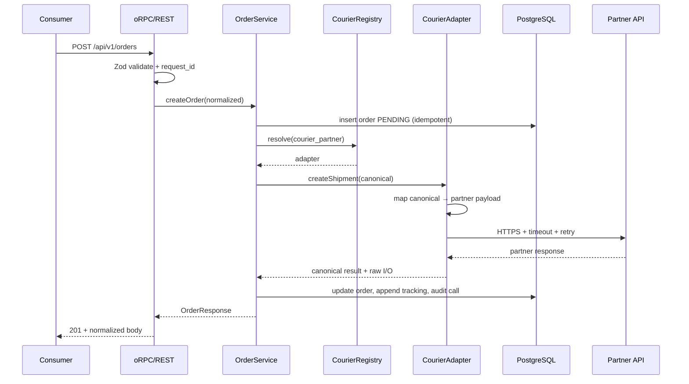
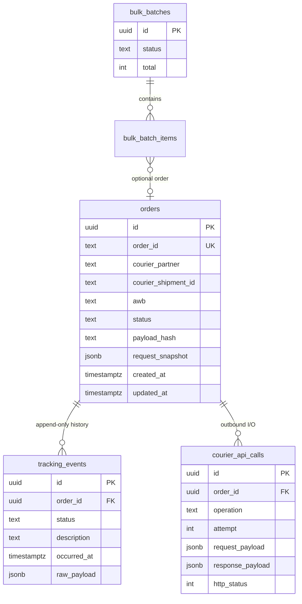

# Technical Specification

**Product:** Multi-Courier Integration Platform  
**Source:** Backend interview PRD (`prd.pdf`)  
**Status:** Draft for implementation  
**Stack baseline:** Better-T-Stack monorepo already in this repository

This document is the engineering contract for the platform. It translates the PRD into architecture, APIs, data model, adapter boundaries, and operational choices. Implementation must follow this spec unless a later change is recorded here.

---

## 1. Purpose

Build a backend service that lets internal consumers (order management, web UI) talk to **one courier-agnostic API**. The first live partner is **UrbaneBolt**. Additional partners (Delhivery, Shiprocket, Bluedart, DTDC, …) must be addable without changing routes, unified DTOs, existing adapters, or core order/tracking/cancel/bulk services.

Consumers pass a `courier_partner` identifier. They never see partner-specific payloads.

## 2. Goals and non-goals

### 2.1 Goals

- Unified REST API under `/api/v1` for create, track, cancel, and bulk create.
- Pluggable courier adapters behind a stable interface (open/closed).
- Persist every order plus append-only tracking history and outbound courier call audit data.
- Bulk create of up to 100 orders with concurrency, partial success, and idempotency on `order_id`.
- Normalized errors; no raw courier error bodies leaked to clients.
- Config-driven credentials, base URLs, timeouts, and retry policy.
- Production-quality logging, tests, and “how to add a courier” documentation.

### 2.2 Non-goals (v1)

- Multi-tenant auth for API consumers (no Better Auth / API keys in v1). The service is treated as an internal network API. Request IDs still identify every call.
- Rate-card, SLA routing, or automatic courier selection. The caller always chooses `courier_partner`.
- Webhooks from couriers. Tracking is pull-based (`GET …/track`).
- Label printing, ePOD, NDR, or pay-mode change as first-class unified endpoints. UrbaneBolt exposes these; we may call them later from a dedicated adapter method, not from the v1 public contract.
- Kafka / Redis / separate worker fleet. Background work runs in-process against PostgreSQL (see §9).

## 3. Current system (constraints)

The repo is already a Turborepo + pnpm workspace. Implementation extends it; it does not replace the stack.

| Layer | Choice |
| --- | --- |
| Apps | `apps/server` (Express 5), `apps/web` (React 19 + TanStack Router) |
| API package | `packages/api` — oRPC router + procedures |
| Persistence | `packages/db` — Drizzle ORM + PostgreSQL 18 |
| Config | `packages/env` — `@t3-oss/env-core` + Zod |
| UI kit | `packages/ui` — shadcn/ui |
| Logging | `evlog` already wired in `apps/server` |
| Validation | Zod 4 |
| Types | TypeScript throughout; end-to-end types via oRPC |
| Local/prod-ish run | `docker-compose.yml` (web, server, postgres) |

**REST vs oRPC.** The PRD requires REST. oRPC already mounts an `OpenAPIHandler`. Procedures will declare OpenAPI `method` + `path` so the public contract is REST at `/api/v1`. The existing `/rpc` endpoint stays for the web app’s typed client. Controllers remain thin either way: both transports call the same services.

Today `OpenAPIHandler` is prefixed `/api-reference`. That prefix moves to `/api/v1`. OpenAPI reference UI can live at `/api-reference` via the existing `OpenAPIReferencePlugin`.

## 4. Architecture

### 4.1 Pattern

**Strategy + Registry (plugin)**, with a thin application service on top.

- `CourierAdapter` is the strategy interface (create, track, cancel, plus auth/health internals).
- `CourierRegistry` maps `courier_partner` → adapter. Unknown keys fail before any courier I/O.
- `OrderService` / `BulkOrderService` own persistence, idempotency, retries, and status mapping. They never `switch` on partner names.
- Each partner lives in its own module. Adding Delhivery is a new adapter file + one registry registration. UrbaneBolt code is not edited.

This satisfies PRD §3.2: routes, DTOs, services, and existing adapters stay closed for modification.

### 4.2 Request flow



### 4.3 Package layout

New code stays in existing packages except a dedicated couriers package so adapters cannot import Express/oRPC and services cannot import UrbaneBolt types.

```
packages/
  env/                 # typed env (extend with courier + retry vars)
  db/                  # Drizzle schema, queries, migrations
  couriers/            # NEW: adapter contract + implementations
    src/
      contract.ts      # CourierAdapter, canonical DTOs, errors
      registry.ts
      http.ts          # fetch wrapper: timeout, retry, redaction
      urbanebolt/
      mock/
      index.ts         # register built-in adapters
  api/                 # oRPC routes + application services
    src/
      dto/             # public Zod schemas (courier-agnostic)
      services/        # OrderService, TrackingService, BulkService
      routers/         # orders, batches, health
      errors.ts        # HTTP mapping of AppError
apps/
  server/              # Express host, OpenAPI mount, job worker start
  web/                 # optional ops UI against /rpc
```

**Dependency direction:** `apps/server` → `api` → `couriers` + `db` + `env`. Adapters depend on `env` and `contract` only. They never import `api` or `db`.

Turborepo: add `packages/couriers` as a workspace package with `check-types`. No new root-level scripts for adapter logic.

## 5. Unified API

Base URL: `http://localhost:3000`  
Public prefix: `/api/v1`  
Content type: `application/json`  
Correlation: every request gets `X-Request-Id` (echo generated UUID if the client omits it).

### 5.1 Endpoints

| Method | Path | Success | Purpose |
| --- | --- | --- | --- |
| `POST` | `/api/v1/orders` | `201` | Create one shipment |
| `GET` | `/api/v1/orders/{order_id}` | `200` | Fetch persisted order |
| `GET` | `/api/v1/orders/{order_id}/track` | `200` | Pull latest status, append history |
| `POST` | `/api/v1/orders/{order_id}/cancel` | `200` | Cancel before pickup |
| `POST` | `/api/v1/orders/bulk` | `202` | Accept up to 100 creates |
| `GET` | `/api/v1/batches/{batch_id}` | `200` | Poll bulk progress |
| `GET` | `/api/v1/couriers` | `200` | List supported partner ids |
| `GET` | `/api/v1/health` | `200` | Liveness |

`order_id` in paths is the **consumer order id** (idempotency key), not the internal UUID. That matches PRD examples and bulk idempotency.

### 5.2 Canonical create payload

Every mutating body includes `courier_partner`. The rest is our schema, not UrbaneBolt’s.

```json
{
  "courier_partner": "urbanebolt",
  "order_id": "OMS-2026-000142",
  "service_type": "NDD",
  "payment": {
    "mode": "COD",
    "declared_value": 1299.0,
    "collectable_value": 1299.0,
    "invoice_number": "INV-8891",
    "invoice_date": "2026-08-19",
    "invoice_value": 1299.0
  },
  "package": {
    "description": "Books",
    "sku": "BK-441122",
    "quantity": 1,
    "pieces": 1,
    "weight_kg": 1.1,
    "length_cm": 12,
    "breadth_cm": 10,
    "height_cm": 10
  },
  "shipper": { "name": "", "phone": "", "email": "", "address_line1": "", "address_type": "Seller", "city": "", "state": "", "pincode": "560001", "country": "IN" },
  "consignee": { "name": "", "phone": "", "email": "", "address_line1": "", "address_type": "Home", "city": "", "state": "", "pincode": "560002", "country": "IN" },
  "return_address": { "name": "", "phone": "", "email": "", "address_line1": "", "address_type": "Seller", "city": "", "state": "", "pincode": "560001", "country": "IN" }
}
```

**Field rules (Zod):**

- `courier_partner`: non-empty snake/kebab string; must exist in the registry.
- `order_id`: 1–64 chars, `[A-Za-z0-9._-]+`. Unique across the platform.
- `service_type`: `SDD` \| `NDD` (extensible enum; unknown values rejected at our API, not silently forwarded).
- `payment.mode`: `COD` \| `PREPAID`.
- COD requires `collectable_value > 0`. PREPAID requires `collectable_value = 0`.
- Pincodes: 6-digit Indian PIN for v1.
- Phones: 10-digit Indian mobile after stripping spaces.
- Dimensions and weight: positive numbers; weight in kilograms.

Optional v1 fields (ignored by adapters that do not need them): `hsn`, `gstin`, `is_reverse`, lat/lng.

### 5.3 Canonical success: create

```json
{
  "order_id": "OMS-2026-000142",
  "internal_id": "0193f0c2-7a1b-7d3e-b8c1-4f2a9e1d6c00",
  "courier_partner": "urbanebolt",
  "courier_shipment_id": "UB-88421",
  "awb": "200000001170",
  "status": "CREATED",
  "created_at": "2026-08-19T12:40:11.204Z",
  "updated_at": "2026-08-19T12:40:11.204Z"
}
```

`courier_shipment_id` may equal `awb` when the partner has no separate shipment id.

### 5.4 Canonical success: track

```json
{
  "order_id": "OMS-2026-000142",
  "courier_partner": "urbanebolt",
  "awb": "200000001170",
  "status": "IN_TRANSIT",
  "history": [
    {
      "status": "CREATED",
      "occurred_at": "2026-08-19T12:40:11.204Z",
      "description": "Shipment manifested",
      "location": null
    },
    {
      "status": "IN_TRANSIT",
      "occurred_at": "2026-08-19T18:02:00.000Z",
      "description": "Reached hub",
      "location": "BLR"
    }
  ]
}
```

Tracking **always** persists new history rows before responding. If the courier is down after retries, return the last known DB state plus `stale: true` and HTTP `200` only when we have a prior successful create. If the order was never manifested, return `502` with `COURIER_UNAVAILABLE`.

### 5.5 Canonical success: cancel

```json
{
  "order_id": "OMS-2026-000142",
  "status": "CANCELLED",
  "cancelled_at": "2026-08-19T13:10:00.000Z"
}
```

Cancel is allowed only when current status is `PENDING`, `CREATED`, or `FAILED` (retry-cancel of a never-picked shipment). `PICKED_UP` and later → `409` `CANCELLATION_NOT_ALLOWED`.

### 5.6 Bulk

**Request**

```json
{
  "orders": [ { "courier_partner": "urbanebolt", "order_id": "…", "…": "…" } ]
}
```

- `orders.length` in `1..=100`.
- Duplicate `order_id` **inside the same batch** → `400` before enqueue.
- Mixed `courier_partner` values are required to work.

**Immediate response (`202`)**

```json
{
  "batch_id": "bch_01J…",
  "accepted": 100,
  "status": "QUEUED",
  "poll_url": "/api/v1/batches/bch_01J…"
}
```

**Poll response**

```json
{
  "batch_id": "bch_01J…",
  "status": "COMPLETED",
  "total": 100,
  "succeeded": 95,
  "failed": 5,
  "results": [
    { "order_id": "A1", "success": true, "awb": "2000…", "status": "CREATED" },
    { "order_id": "A2", "success": false, "error": { "code": "COURIER_REJECTED", "message": "Pincode not serviceable" } }
  ]
}
```

Batch `status`: `QUEUED` → `PROCESSING` → `COMPLETED` \| `FAILED` (`FAILED` only if the worker itself dies before finishing; per-order failures still yield `COMPLETED` with mixed results).

### 5.7 List couriers

```json
{ "couriers": ["urbanebolt", "mock"] }
```

Unknown `courier_partner` on any write uses this list in the error `details`.

## 6. Error handling

### 6.1 Envelope (all endpoints)

```json
{
  "error": {
    "code": "VALIDATION_ERROR",
    "message": "Request validation failed",
    "request_id": "req_01J…",
    "details": [
      { "field": "consignee.pincode", "message": "Must be a 6-digit Indian pincode" }
    ]
  }
}
```

`details` is `[]` when there is no field-level info. Never include partner HTML/JSON bodies, tokens, or stack traces in this envelope.

### 6.2 Error codes and HTTP status

| Code | HTTP | When |
| --- | --- | --- |
| `VALIDATION_ERROR` | `400` | Zod failure |
| `UNKNOWN_COURIER` | `400` | `courier_partner` not in registry |
| `UNSUPPORTED_SERVICE` | `400` | Adapter cannot fulfill `service_type` / payment mode |
| `ORDER_NOT_FOUND` | `404` | Unknown `order_id` |
| `IDEMPOTENCY_CONFLICT` | `409` | Same `order_id`, different payload hash |
| `CANCELLATION_NOT_ALLOWED` | `409` | Shipment already in transit / delivered |
| `COURIER_REJECTED` | `422` | Partner 4xx after mapping (pincode, duplicate AWB, etc.) |
| `COURIER_AUTH_FAILED` | `502` | Re-auth + retry still unauthorized |
| `COURIER_UNAVAILABLE` | `502` | 5xx, timeout, or network after retries |
| `INTERNAL_ERROR` | `500` | Unexpected bug |

oRPC/Zod validation is translated into `VALIDATION_ERROR` by a single interceptor. Adapters throw `CourierError` subclasses; services never pass them through raw.

### 6.3 Partner error mapping

- Partner **4xx** (except 401): map to `COURIER_REJECTED` with a short, allowlisted message (`Pincode not serviceable`, `Duplicate order`, `Cancellation window closed`, `Invalid payload`). Default message: `Courier rejected the request`.
- Partner **401**: adapter refreshes token and retries **once**. Still 401 → `COURIER_AUTH_FAILED`.
- Partner **5xx / timeout / DNS / reset**: retry with exponential backoff (see §10), then `COURIER_UNAVAILABLE`. Persist the failed order row so reconciliation can retry later.
- Never copy `response.data` from the partner into the client body. Store it only in `courier_api_calls`.

## 7. Data model

PostgreSQL via Drizzle. UUIDv7 (or `uuid` + `created_at`) for internal keys. Timestamps `timestamptz`. JSON payloads `jsonb`.

### 7.1 ERD



### 7.2 `orders`

| Column | Notes |
| --- | --- |
| `id` | Internal UUID (PRD “internal order ID”) |
| `order_id` | Consumer id, **UNIQUE** — idempotency key |
| `courier_partner` | e.g. `urbanebolt` |
| `courier_shipment_id` | Partner order/shipment id; nullable until create succeeds |
| `awb` | Tracking number; nullable until assigned |
| `status` | Canonical enum (below) |
| `payload_hash` | SHA-256 of canonical create body (stable JSON stringify) |
| `request_snapshot` | Full normalized create body |
| `last_courier_request` | Last outbound create payload (partner shape) |
| `last_courier_response` | Last inbound create response (partner shape) |
| `last_error_code` | Nullable; set on terminal failure |
| `batch_id` | Nullable FK to `bulk_batches` |
| `created_at` / `updated_at` | |

Indexes: `order_id` unique; `(courier_partner, awb)` unique where `awb is not null`; `status`; `batch_id`.

**Canonical `status`:** `PENDING` \| `CREATED` \| `PICKED_UP` \| `IN_TRANSIT` \| `OUT_FOR_DELIVERY` \| `DELIVERED` \| `RTO` \| `CANCELLED` \| `FAILED`.

PRD examples (`CREATED`, `PICKED_UP`, `IN_TRANSIT`, `DELIVERED`, `CANCELLED`, `FAILED`) are a subset. Extra values are additive and still courier-agnostic. Adapters map unknown partner statuses to `IN_TRANSIT` and keep the raw string in `tracking_events.raw_payload`.

`PENDING` is ours: row inserted before the partner call. `FAILED` is after retries exhausted.

### 7.3 `tracking_events` (append-only)

No updates, no deletes in application code. Insert on create, every successful track poll, cancel, and mapped failure.

| Column | Notes |
| --- | --- |
| `id` | UUID |
| `order_id` | FK `orders.id` |
| `status` | Canonical status at this point |
| `partner_status` | Raw partner status string |
| `description` | Human-readable, mapped |
| `location` | Nullable |
| `occurred_at` | Partner timestamp if present, else `now()` |
| `raw_payload` | Full partner tracking object |
| `created_at` | Insert time |

Dedup: unique `(order_id, occurred_at, partner_status)` so repeated track polls do not explode the table.

### 7.4 `courier_api_calls`

One row per HTTP attempt (including retries).

| Column | Notes |
| --- | --- |
| `order_id` | Nullable for token calls |
| `courier_partner` | |
| `operation` | `AUTH` \| `CREATE` \| `TRACK` \| `CANCEL` |
| `attempt` | 1-based |
| `request_url` | Path only + host, no credentials |
| `request_payload` | JSON; secrets redacted |
| `response_payload` | JSON or `{ "text": "…" }` |
| `http_status` | Nullable if network error |
| `error_type` | `TIMEOUT` \| `NETWORK` \| `HTTP` \| null |
| `duration_ms` | |
| `request_id` | Our correlation id |
| `created_at` | |

This plus `orders.last_courier_*` covers PRD “full request/response for audit/debugging”.

### 7.5 Bulk tables

**`bulk_batches`:** `id`, `status`, `total`, `succeeded`, `failed`, `created_at`, `updated_at`, `completed_at`.

**`bulk_batch_items`:** `batch_id`, `order_id` (consumer), `position`, `status` (`QUEUED` \| `SUCCEEDED` \| `FAILED`), `error_code`, `error_message`, `order_uuid` (FK, nullable until insert).

### 7.6 Idempotency algorithm

On create (single or bulk item):

1. Hash the canonical payload (exclude nothing except volatile client metadata if we add it later).
2. `INSERT … ON CONFLICT (order_id) DO NOTHING RETURNING *`.
3. If insert won: proceed to courier.
4. If conflict: load existing. If `payload_hash` matches → return existing success (or current `FAILED`/`PENDING` state). If hash differs → `IDEMPOTENCY_CONFLICT`.

Do **not** create a second shipment at the partner. If the first attempt is `PENDING` (crash after insert, before partner success), the same `order_id` retries the partner call; adapters must send the same `orderNumber` so the partner’s own idempotency (if any) also helps.

## 8. Courier adapters

### 8.1 Contract

```ts
type CourierPartnerId = string; // registered ids: "urbanebolt" | "mock" | …

interface CreateShipmentInput {
  orderId: string;
  serviceType: "SDD" | "NDD";
  payment: { mode: "COD" | "PREPAID"; declaredValue: number; collectableValue: number; invoiceNumber: string; invoiceDate: string; invoiceValue: number };
  pkg: { description: string; quantity: number; pieces: number; weightKg: number; lengthCm: number; breadthCm: number; heightCm: number; sku?: string };
  shipper: Address;
  consignee: Address;
  returnAddress: Address;
}

interface CreateShipmentResult {
  courierShipmentId: string;
  awb: string;
  partnerStatus: string;
  rawRequest: unknown;
  rawResponse: unknown;
}

interface TrackResult {
  partnerStatus: string;
  events: Array<{ partnerStatus: string; description: string; location?: string; occurredAt: Date; raw: unknown }>;
  rawResponse: unknown;
}

interface CourierAdapter {
  readonly id: CourierPartnerId;
  createShipment(input: CreateShipmentInput, ctx: AdapterContext): Promise<CreateShipmentResult>;
  track(input: { awb: string; courierShipmentId?: string }, ctx: AdapterContext): Promise<TrackResult>;
  cancel(input: { awb: string; courierShipmentId?: string }, ctx: AdapterContext): Promise<{ rawRequest: unknown; rawResponse: unknown }>;
  mapStatus(partnerStatus: string): CanonicalStatus;
}
```

`AdapterContext` carries `requestId`, `orderId`, abort signal, and a logger. Adapters must not log tokens.

Registry:

```ts
registry.get("urbanebolt"); // adapter
registry.get("nope");      // throws UnknownCourierError
registry.list();           // ["mock", "urbanebolt"]
```

Registration happens in `packages/couriers/src/index.ts` at module load. Services depend only on the registry interface.

### 8.2 Adding a courier (checklist)

1. Create `packages/couriers/src/<partner>/adapter.ts` implementing `CourierAdapter`.
2. Add env vars in `packages/env/src/server.ts` (`<PARTNER>_BASE_URL`, credentials, timeout).
3. Register: `registry.register(new DelhiveryAdapter())`.
4. Add status map + unit tests with mocked HTTP.
5. Do **not** change routers, Zod public DTOs, `OrderService`, or other adapters.

Optional: `packages/couriers/src/<partner>/mapper.ts` isolated so payload mapping is testable without I/O.

### 8.3 UrbaneBolt adapter

**Docs:** [UrbaneBolt Customer API (UAT Postman)](https://documenter.getpostman.com/view/19172174/2sAYHzFhxb)  
**Base URL (default):** `https://uat.urbanebolt.in` — override with `URBANEBOLT_BASE_URL`.

v1 uses these partner operations only:

| Our operation | Partner | Auth |
| --- | --- | --- |
| Authenticate | `POST /api/v1/auth/getToken/` | username + password JSON body |
| Create | `POST /api/v1/services/manifest/` | `Authorization: Bearer <token>` |
| Track | `GET /api/v1/services/tracking-pub/?awb=` | Bearer |
| Cancel | `POST /api/v1/services/cancel/` body `{ "awbs": "<awb>" }` | Bearer |

**Out of v1 public API** (adapter may leave unimplemented or private): pincode lookup, print label, NDR RTO/RAD, pay-mode change, ePOD, `global-manifest`. Pincode can be a later `supportsPincode` hook; not required by the PRD.

**Auth cache.** Process-local token with expiry. If the partner does not return `expires_in`, treat TTL as `URBANEBOLT_TOKEN_TTL_SECONDS` (default `3300`). On 401, invalidate cache, `getToken` again, retry the original call once.

**Create mapping (canonical → manifest item):**

| Canonical | UrbaneBolt |
| --- | --- |
| env `URBANEBOLT_CUSTOMER_CODE` | `customerCode` |
| `orderId` | `orderNumber` |
| `payment.declaredValue` | `declaredValue` |
| `package.description` | `itemDescription` |
| `payment.collectableValue` | `collectableValue` |
| `package.heightCm` / `lengthCm` / `breadthCm` / `weightKg` / `pieces` | `height`, `length`, `breadth`, `weight`, `pieces` |
| `serviceType` | `serviceType` (`SDD` / `NDD`) |
| `payment.mode` `PREPAID` → `PPD`; `COD` → `COD` | `payMode` |
| `shipper.*` | `shpr*` |
| `consignee.*` | `cons*` |
| `returnAddress.*` | `rtn*` |
| `payment.invoice*` | `invoiceNumber`, `invoiceDate`, `invoiceValue` |
| `package.quantity` | `itemQuantity` |

Manifest API accepts an **array**. We send a single-element array per order so bulk concurrency stays per-order at our layer (partner bulk-manifest is not used for our bulk endpoint). That keeps per-order success/failure and mixed partners simple.

**Create response.** Parse AWB / partner order id from the documented JSON. Exact keys to be confirmed against a live UAT response during implementation; isolate parsing in `urbanebolt/parse.ts`. If the body is an array, use element `0`. Missing AWB → treat as `COURIER_REJECTED`.

**Track.** Query `awb`. Map travel history entries into `TrackResult.events`. Status mapper table lives in `urbanebolt/status.ts` and is updated as real UAT strings are observed. Until then, heuristic: case-insensitive includes (`delivered` → `DELIVERED`, `cancel` → `CANCELLED`, `pick` → `PICKED_UP`, `out for delivery` / `ofd` → `OUT_FOR_DELIVERY`, `rto` → `RTO`, else `IN_TRANSIT` if history exists, `CREATED` if only manifested).

**Cancel.** `{ awbs: string }` as in the collection (single AWB string, not an array).

**Credentials.** Only from env. Do not commit the sample username/password from the public Postman collection. If those are used locally, they belong in `apps/server/.env` (gitignored).

### 8.4 Mock courier (bonus)

`id: "mock"`. No network.

- `createShipment`: returns `awb = MOCK-{orderId}` unless `orderId` contains `FAIL` → `COURIER_REJECTED`.
- `track`: cycles `CREATED` → `IN_TRANSIT` → `DELIVERED` based on elapsed time since create (deterministic from hash of `orderId` for tests).
- `cancel`: succeeds unless AWB already `DELIVERED`.

Used in automated tests and to prove the registry is partner-agnostic.

## 9. Bulk processing

### 9.1 Decision: `202` + `batch_id` (not inline, not SSE)

PRD asks to document the choice.

| Option | Pros | Cons |
| --- | --- | --- |
| Sequential in one HTTP request | Simple | Violates PRD; 100 partner RTTs; gateway timeouts |
| `Promise.all` in the request | Faster | Still holds the HTTP connection; mixed partners + retries can exceed 30–60s; client disconnects cancel work |
| SSE / streaming results | Live UX | Awkward for OMS; retries and reconnects are messy |
| **`202` + poll** | Responsive API; retries survive the original request; partial success is a stable resource | Extra poll endpoint; need a worker |

**Choice:** enqueue and return `batch_id` immediately (`202`). Process in the background with bounded concurrency.

### 9.2 Queue without Redis

PostgreSQL is already required. Use a **`bulk_batch_items` skip-locked worker** in `apps/server`:

1. HTTP handler validates, inserts `bulk_batches` + items + idempotent `orders` (`PENDING`), returns `202`.
2. In-process loop (started with the Express server): `SELECT … FROM bulk_batch_items WHERE status = 'QUEUED' FOR UPDATE SKIP LOCKED LIMIT N`, then `OrderService.create` per row.
3. Concurrency: `p-limit(BULK_CONCURRENCY)` default `10`.
4. Crash safety: items left `QUEUED` or `PROCESSING` past `BULK_ITEM_STALE_MS` are reclaimed on the next tick.

No extra broker. Horizontal scale of multiple server replicas is safe because of `SKIP LOCKED`. Single replica is enough for the assignment.

### 9.3 Partial success

The poll payload is the source of truth. HTTP `202` on accept never means all shipments exist. A batch with 95/5 is `COMPLETED` with per-`order_id` reasons.

## 10. Resilience

All outbound partner calls go through `packages/couriers/src/http.ts`.

| Knob | Env | Default |
| --- | --- | --- |
| Request timeout | `COURIER_TIMEOUT_MS` | `10000` |
| Max attempts (5xx/timeout/network) | `COURIER_RETRY_ATTEMPTS` | `3` |
| Backoff base | `COURIER_RETRY_BASE_MS` | `200` |
| Backoff cap | `COURIER_RETRY_MAX_MS` | `2000` |
| Jitter | always full jitter | — |
| Bulk concurrency | `BULK_CONCURRENCY` | `10` |
| Bulk worker interval | `BULK_POLL_INTERVAL_MS` | `500` |

Retry **only** on network errors, timeouts, and HTTP 5xx. Do not retry 4xx except the dedicated 401 re-auth path.

Backoff: `min(cap, base * 2 ** (attempt - 1)) * random(0, 1)`.

`AbortSignal` from the HTTP client timeout is independent of the consumer disconnecting on bulk (bulk work is not tied to the original request socket).

## 11. Configuration

Extend `packages/env/src/server.ts`. No hardcoded URLs, keys, or retry counts.

```text
DATABASE_URL=
CORS_ORIGIN=
NODE_ENV=

COURIER_TIMEOUT_MS=10000
COURIER_RETRY_ATTEMPTS=3
COURIER_RETRY_BASE_MS=200
COURIER_RETRY_MAX_MS=2000
BULK_CONCURRENCY=10
BULK_POLL_INTERVAL_MS=500

URBANEBOLT_BASE_URL=https://uat.urbanebolt.in
URBANEBOLT_USERNAME=
URBANEBOLT_PASSWORD=
URBANEBOLT_CUSTOMER_CODE=
URBANEBOLT_TOKEN_TTL_SECONDS=3300
```

Mock adapter needs no secrets. Missing UrbaneBolt vars: the process may boot, but `urbanebolt` create/track/cancel fail with `COURIER_AUTH_FAILED` / config error at first use. Prefer failing fast at startup if `urbanebolt` is registered and credentials are empty in `production`.

## 12. Observability

Replace `console.error` in oRPC interceptors with **evlog** wide events (already initialized in `apps/server`).

Every failure and every partner call logs at least:

- `request_id`
- `order_id` (consumer)
- `courier_partner`
- `error_type` / `code`
- `operation`
- stack on `INTERNAL_ERROR` only (evlog structured error), never in HTTP bodies

Suggested event names: `order.create`, `order.track`, `order.cancel`, `order.bulk.accept`, `courier.http`.

Persist audit payloads in `courier_api_calls` (PRD debugging). Logs must **redact** `Authorization`, passwords, and tokens.

## 13. Application services (business rules)

`OrderService` (packages/api), partner-agnostic:

1. Validate partner via registry (unknown → `UNKNOWN_COURIER` with `registry.list()`).
2. Idempotent insert (`PENDING`).
3. `adapter.createShipment`.
4. On success: set `CREATED`, AWB, shipment id, last request/response; insert first tracking event.
5. On mapped 4xx: `FAILED`, persist payloads, throw `COURIER_REJECTED`.
6. On unavailable: `FAILED`, throw `COURIER_UNAVAILABLE`.

`TrackingService`: load order → require AWB → `adapter.track` → map statuses → append new events → update `orders.status` to the latest canonical status (never move backwards from `DELIVERED` / `CANCELLED` except if partner later reports RTO after delivered — ignore regressions unless partner status is `RTO`).

`CancelService`: state guard → `adapter.cancel` → `CANCELLED` + tracking event. If partner says already cancelled, treat as success (idempotent cancel).

Services take `CourierRegistry` and `db` as constructor args for tests.

## 14. HTTP host

`apps/server/src/index.ts`:

- Keep `evlog` + CORS + JSON.
- `RPCHandler` prefix `/rpc`.
- `OpenAPIHandler` prefix `/api/v1` with Zod → JSON Schema converter.
- Health: `GET /` stays; also `GET /api/v1/health`.
- Start bulk worker after listen.
- Map `AppError` → envelope in `onError`. Unexpected errors → `INTERNAL_ERROR` + log stack.

oRPC procedure sketch:

```ts
export const createOrder = publicProcedure
  .route({ method: "POST", path: "/orders" })
  .input(createOrderSchema)
  .handler(({ input, context }) => orderService.create(input, context));
```

## 15. Web UI (optional, same repo)

Not required by the PRD. If time allows, `apps/web` should call `/rpc` (already wired) for:

- Create order form
- Track + history timeline
- Cancel
- Submit bulk JSON and poll batch status

This exercises the typed client and demonstrates the unified contract. No partner fields in the UI except a `courier_partner` select from `GET /couriers`.

## 16. Testing

Use **Vitest** (already used in `packages/api`).

| Layer | What |
| --- | --- |
| Zod DTOs | Valid / invalid payloads, bulk size 0 and 101 |
| Registry | Unknown partner; mock + urbanebolt ids |
| UrbaneBolt mapper | Canonical → manifest field mapping (no network) |
| UrbaneBolt HTTP | Mock `fetch`: token, 401 refresh+retry, 4xx map, 5xx retry then fail |
| OrderService | Idempotent replay; conflict on hash mismatch; no adapter call on unknown partner |
| Bulk | Mixed partners; 95/5 partial; duplicate `order_id` in one request |
| Mock adapter | Plug-in proof: same service path as UrbaneBolt |

Integration (optional): Testcontainers PostgreSQL or docker-compose `postgres` + `db:push`. Do not hit real UAT in CI.

## 17. Deliverables mapping

| PRD item | Where |
| --- | --- |
| Source repo | this workspace |
| README: setup, env, run, test, add courier | update root `README.md` at implementation time |
| Short DESIGN.md (1–2 pages) | extract from §§4, 7, 9 of this spec into `DESIGN.md` when shipping |
| Postman / curl | `docs/http-examples.md` or `postman/collection.json` after routes exist |
| MockCourier | `packages/couriers/src/mock` |
| This document | `docs/technical-specification.md` |

## 18. Implementation sequence

1. Env vars + Drizzle tables + migrate.
2. `packages/couriers` contract, http helper, mock adapter, registry.
3. `OrderService` + REST/oRPC create/get against mock.
4. UrbaneBolt auth + manifest + track + cancel with mocked unit tests, then UAT smoke.
5. Tracking history + cancel guards.
6. Bulk enqueue + worker + poll.
7. Error interceptor, evlog fields, retries.
8. README, DESIGN.md, Postman/curl.
9. Optional web UI.

## 19. Assumptions

- Consumers are trusted (internal). No user auth in v1.
- One platform-wide unique `order_id` (not unique-per-partner).
- India-centric addresses and pincodes for v1.
- UrbaneBolt UAT is reachable from the developer machine; credentials supplied via env.
- Partner create/track/cancel JSON shapes may differ slightly from Postman samples; parsers are isolated and covered by fixtures once a real response is captured (fixtures in repo, no secrets).
- Webhooks are out of scope; status freshness depends on consumers calling track.
- “Minimal code changes” for a new courier means **one adapter module + env + one register call**, not zero files.

## 20. Open items (resolve during implementation, not blockers)

1. Exact UrbaneBolt manifest/track JSON response keys — confirm with one UAT call; freeze in `urbanebolt/parse.ts` + fixture.
2. Whether UAT `getToken` returns expiry; until then use `URBANEBOLT_TOKEN_TTL_SECONDS`.
3. If reviewers insist on fully synchronous bulk, we can add `?wait=true` later; default remains `202`.

---

*End of technical specification.*
